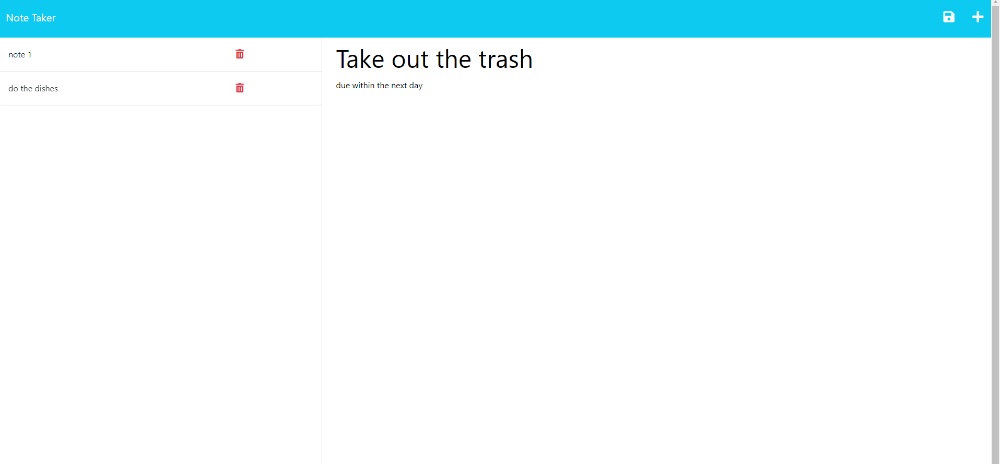

# README.md for 11 Express.js: Note Taker

## Description
This Note Taker application is designed for small business owners or anyone who needs to keep track of tasks or jot down thoughts. The application allows users to write, save, and delete notes. It leverages an Express.js back end and saves note data to a JSON file.

## Table of Contents
* [Installation](#installation)
* [Usage](#usage)
* [License](#license)
* [Questions](#questions)

## Installation
To install the application, clone the repository and run `npm install` to install the dependencies.

## Usage
To use the application, run `node server.js` or `npm start` to start the server. Then, navigate to `localhost:3001` in your browser to view the application.To create a new note, click the plus icon in the top right corner. Enter a title and text for your note, then click the save icon in the top right corner. To view a saved note, click on the note title in the left column. To delete a note, click the trash can icon next to the note title in the left column.

## License
This application is covered under the MIT license.

## Questions
For questions about this application, please contact me at: evanjpieper@gmail.com

## Contributing
For instructions on how to contribute, please contact me at: evanjpieper@gmail.com

## Tests
NA

## Credits
EDX Bootcamp